# Vegan Sneaker Store

## Table of Contents
* [Introduction](#introduction)
* [Agile development](#agile-development)
* [Marketing](#marketing)
* [Features](#features)
* [Technologies](#technologies)
* [Testing](#testing)
* [Bugs](#bugs)
* [Deployment](#deployment)
* [Credits](#credits)
* [Acknowledgements](#acknowledgements)

***
## Introduction

As market for leather-free and sustainable clothing is growing, there was a natural decision to make a website that goes with changing times.
Eating vegetarian myself for decades and being more compassionate towards all life i started to look for alternative options to leather products.  

It was not an easy task at first, it was hard to find leather-free shoes or sneakers that i liked. I would go to local stores to inspect labels, speak with staff and even then, assortment was very limited. Online you would think it would be easier, but in reality most sites did not post full materials list or labels at all! Even big brands. Googling further often brought conflicting informations..  

So it became increasingly difficult and frustrating. Ofc i understood its a new industry, but still...
I was often thinking: "Why is there no big sneaker store with just leather free sneakers??
Time passed, i enrolled in web development course, still with this question popping from time to time.  

Eventually i connected the dots, and hence, a perfect idea was born.. :)

[Vegan Sneaker Store](https://vegan-sneaker-store.herokuapp.com/)
***

## Agile development

### User stories

To create user stories as per principles of agile development, we used **kanban** board in our development which is part of Github Projects.
We separated user stories into 5 logical categories, or milestones, and furthermore added assigned tasks and requirements. For illustrative purpose we will only list user stories with associated milestones here.

For full details please check out our link on Github: [V.S. Store User Stories](https://github.com/users/denisklopotan/projects/4)

#### EPIC | Navigation

* As a user I can easily navigate trough the website so that i can access acces preffered content
* As a user I can view list of products so that i can chose ones i like
* As a user I can open selected product so that i can see more details about it
* As a user I can sort products by category so that i can view only by preferred category
* As a user I can use search function so that i can find products quickly

#### EPIC | Purchasing

* As a customer I can select size and quantity so that i can purchase products that fit me
* As a customer I can add products to bag so that i can make purchase
* As a customer I can access my shopping bag so that i can add, remove or update products in it
* As a customer I can easily see subtotal so that i can keep track with my budget
* As a customer I can acess checkout page and enter my details so that I can purchase selected products
* As a customer I can see order confirmation so that i know order was placed correctly
* As a customer I can receive order email so that i have order receipt and details archived in email

#### EPIC | Authentication

* As a user I can create account (register) so that i can access additional features
* As a user I can log in/out from account so that i can have registered user privileges
* As a registered user I can have personalised user account so that i can store personal details like address or purchase history
* As a user I can easily see login status so that i can act accordingly and adress privacy or safety issues
* As a user I can receive email after creating user account so that i know registration was successful
* As a registered user I can recover my password so that i can still access the site in case of forgotten password

#### EPIC | Administration

* As an admin I can access admin panel so that i can use admin features and manage website
* As a site admin I can add or delete products so that i can manage site content / store stock

#### EPIC | Interaction

* As a user I can fill in the contact form so that I can contact store directly
* As a user I can subscribe to the newsletter so that i can be up to date with new products or promotions
* As a user I can access media links so that i can discover more of authors work or contact trough other means
* As a registered user I can write a product review so that i can give an honest feedback
* As a user I can like products so that i can save them to wishlist for future reference

### Wireframes

Wireframes provided are created in [Balsamiq](https://balsamiq.com).

 
Products list

 
Products detail

 
Form example

 
Mobile example

### Database schema

Database schema was created using online tool - [drawSQL](https://drawsql.app/).

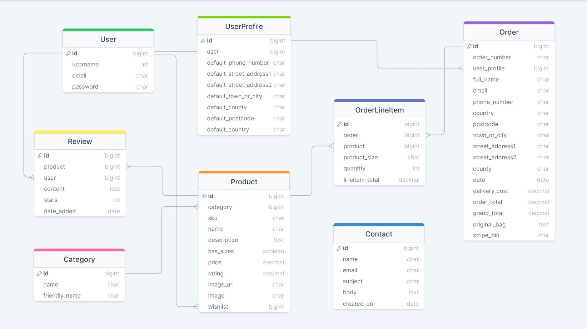

***
## Marketing

### Business model

Vegan Sneaker Store's Business model is **Business to Consumer (B2C)**. Products and services are sold directly from V.S. Store to consumers who are the end-users.

Customers of Vegan Sneaker Store would be clearly people eating Vegan / Vegetarian diet which is growing trend; people who support use of alternative, sustainable materials or care for animals. Last but not least, important demographic in this case is religious.

More than billion people are Hindus who are traditionally vegetarian and consider cow a sacred animal, and also other forms of life. Most leather used in industry comes from cows, so this is one initiative to offset that.

There are also 400 million Buddhist. One of the teachings prohibits taking the life of any person or animal. Many Buddhists interpret this to mean that you should not consume animals, as doing so would require killing. Buddhists with this interpretation usually follow a lacto-vegetarian diet.

From these few examples is seen that there is significant potential for this business on the market.

### Marketing types used

#### **SEO (Search Engine Optimization)**

In simple terms, SEO is process of improving our site to increase its visibility when people search for products or services related to our business in Google, Bing, and other search engines. The better visibility our pages have in search results, the more likely we are to garner attention and attract prospective and existing customers to our business.

To improve our SEO rating we did the following:
- Added `<title>` to the head of our HTML file
- Added `<meta>` description and keywords collection to head of HTML
- Used heading tags `<h1>`, `<h2>`, ..  by matter of importance
- Marked important keywords in **Bold** formatting
- Gave media files meaningful and descriptive names
- using `rel` attributes and `aria` labels in our links
- Created sitemap.xml and robots.txt
- planned to use more `alt` attribute where applicable

#### **Content marketing**

At this point we are just building the brand so content marketing is not so developed as we would like. Most content would be provided trough newsletter or Faceboook page posts. Features to be implemented like blog posts would greatly improve this rating!

#### **Social Media marketing**

Social media marketing is important tool to use nowdays. We took advantage of well established platform **Facebook** to create our business page. Hopefuly it will further advertise and bring traffic to our site. [Link to page](https://www.facebook.com/VeganSneakerStore).

 

#### **Email marketing**

For email marketing we used **Mailchimp** service. We created Mailchimp account for our business and copied generated form into footer of our site.

Embedded form provides simple interface for users to enter their email and subscribe to our **newsletter**.

 

If you want to use Mailchimp for your site please visit their website [here](https://mailchimp.com/).

### Privacy policy

Lastly, to be compliant with GDPR or 'General Data Protection Regulation' and furthermore improve our sites rating we generated 'Privacy Policy' using online generator - [Privacy Policy Generator](https://www.privacypolicygenerator.info/). Link is embedded in the footer of the site.

***
## Features

### Homepage
Homepage consists of top navbar which is collapsible on mobile screens, main section with shop now button and footer. More about it in the following sections.
 

### Navbar
Navbar contains store Logo / title on the left, search bar in the top middle, category dropdowns below it, account, favorites and shopping bag links on the top right. Underneath is delivery banner showing delivery treshold. All the links in dropdowns lead to their respectible pages.

ALL PRODUCTS, SNEAKERS, SPECIAL OFFERS and My Account contain dropdown links.

Products dropdown

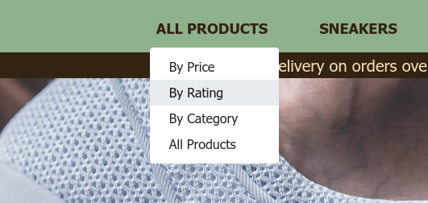  

Account dropdown

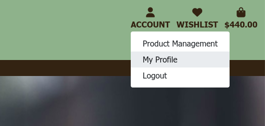 

### Body
Contains button link to products page.

### Footer
Footer contains link to Contact form, Social media sites like Facebook business page, Privacy Policy and on the right Mailchimp form with which users can subscribe to newsletter.
 

### Products list
Product page contains list of products which can be sorted by categories using category selector or selecting from the dropdown menu.
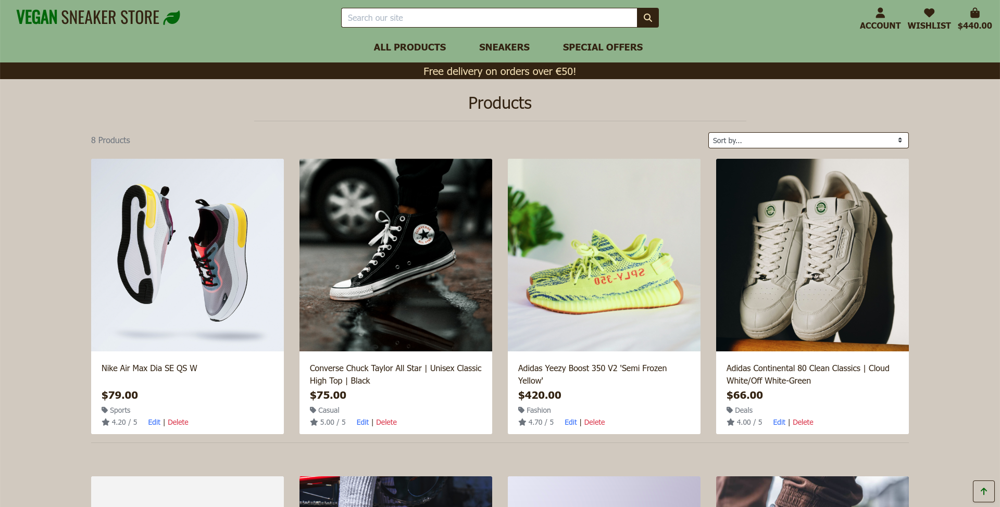 

Category selection

  

Category selector

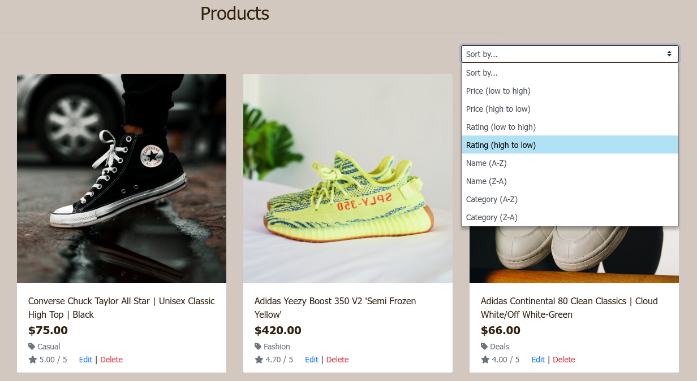  

### Product detail
Product detail page showcases: Product title, description, price, rating, category, favorites button, size selector, quantity selector, buttons, product review form and if user is admin; it contains edit|delete buttons for product managment.
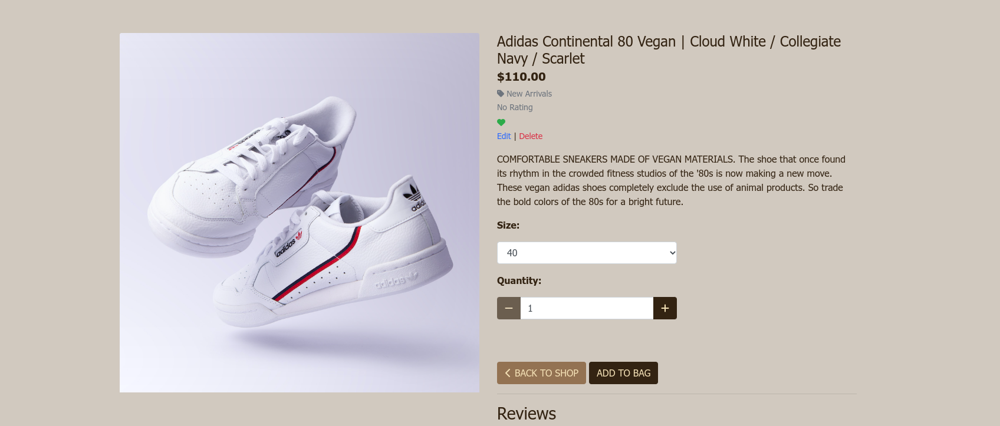 

Size and quantity selector

  

User reviews

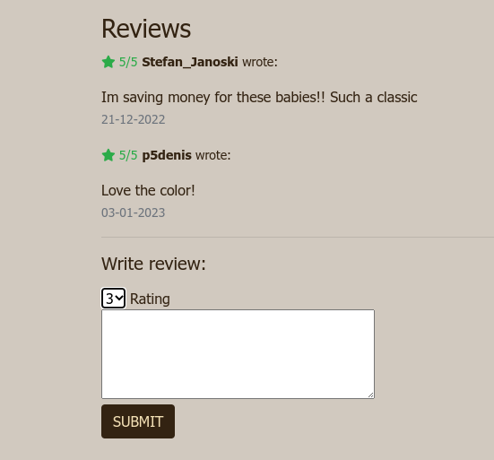  

### Accounts
Users have option to Login / Register by which they can access and edit their user profile and see also order history. If authenticated user is Admin, it can access roduct Managment panel from which it can edit or delete store products without need to go to admin panel.
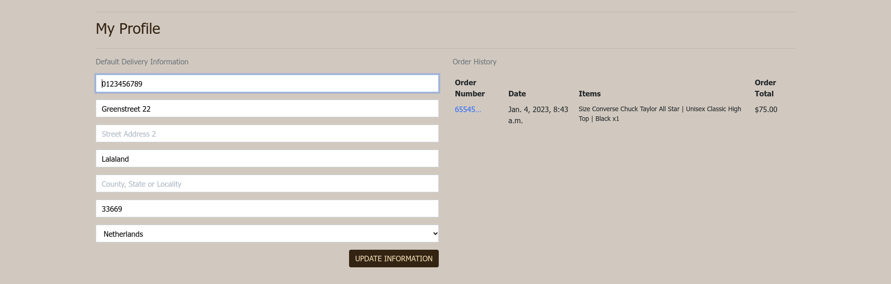  

Sign In

  

Sign Up

  

Sign Out

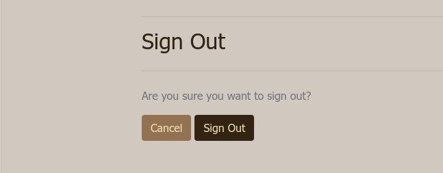  

Product Managment

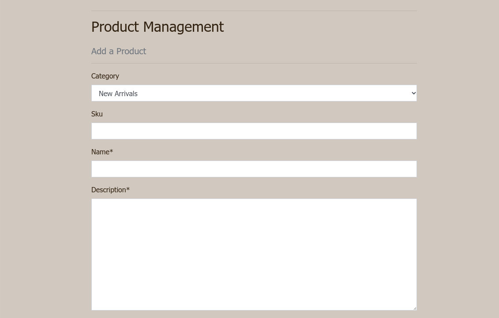  

### Shopping bag
Shopping bag allows us to adjust quantity inside bag itself and provides link to product page or checkout. After order has been succesfuly added we are informed by pop-up message in top right corner.
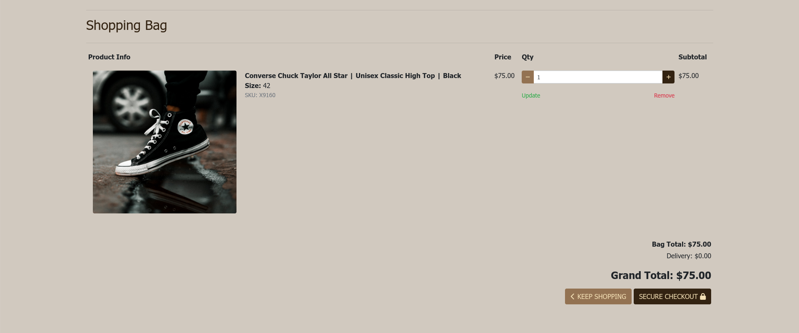 

Pop-up message - Added to bag

 

### Checkout
Checkout page provides billing form connected with Stripe, our order details and link to checkout. After order has been succesfully placed we are notified via pop-up message and presented with order summary.
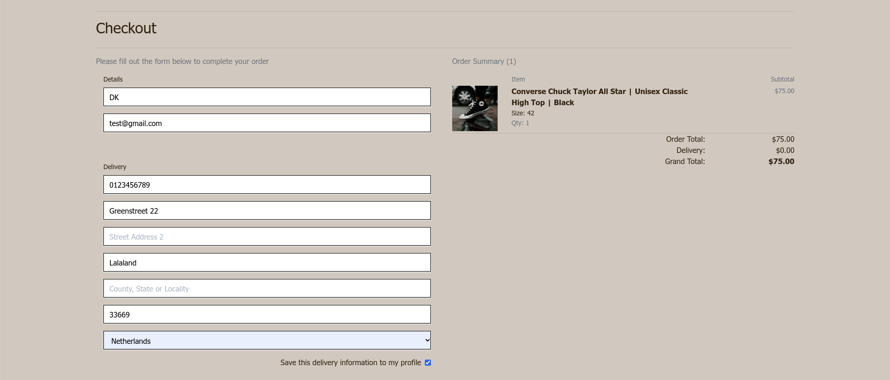 

Checkout - part 2

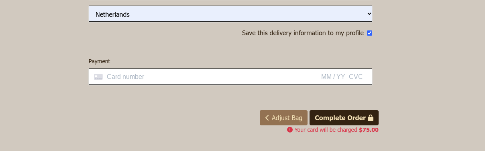 

Pop-up message - Order Processed

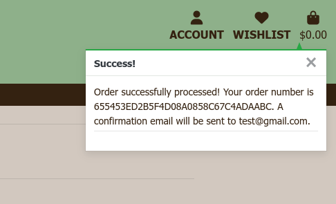 

Order summary

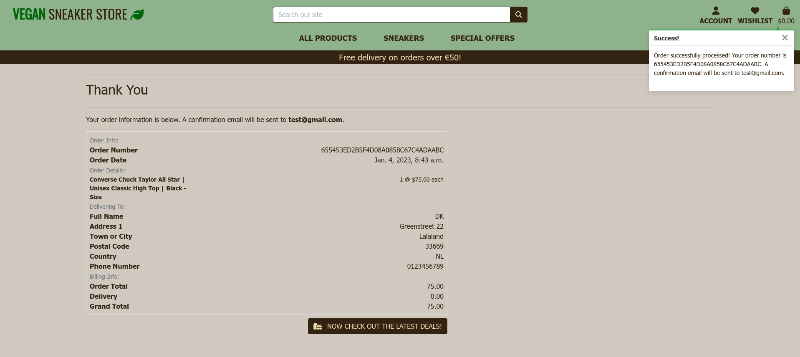 

### Contact us
Simple form for user to contact admin or store owner.
 

### Mobile
Mobile page is fully responsive and contains hamburger icon or toggler which is collapsible. It contains our navbar links and menus. As we can see they are still  

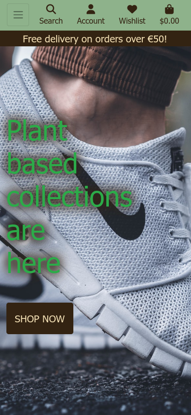 

Category dropdown

 

 
Footer and Search

 

 
Product detail

 

 
Form example

 

### To be implemented

Features to implement:

- Password recovery
- Blog post

***
## Technologies

Main technologies used for building this ecommerce from ground up where Python & Django.
To manage, store and host data as PostgreSQL we used ElephantSQL service.
And to process payments we integrated Stripe payments provider.

### Languages:

- [HTML5](https://en.wikipedia.org/wiki/HTML5)
        - [CSS3](https://en.wikipedia.org/wiki/CSS)
        - [JavaScript](https://www.javascript.com)
- [Python](https://www.python.org) is a high-level, general-purpose programming language. Its design philosophy emphasizes code readability with the use of significant indentation. Python is dynamically-typed and garbage-collected. It supports multiple programming paradigms, including structured (particularly procedural), object-oriented and functional programming. It is often described as a "batteries included" language due to its comprehensive standard library.

### Frameworks:

- [Django](https://www.djangoproject.com) is a free and open-source, Python-based web framework that follows the model-views-template (MVT) architectural pattern. Django web framework comes with a wide range of features and tools that are ready to use out of the box. Thats why its often refferd to as: "Batteries Included framework".
- [Bootstrap](https://getbootstrap.com/) is a free and open-source CSS framework directed at responsive, mobile-first front-end web development. It contains HTML, CSS and (optionally) JavaScript-based design templates for typography, forms, buttons, navigation, and other interface components.

### Libraries:

- [Google Fonts](https://fonts.google.com)
        - [Font Awesome](https://fontawesome.com)

### Packages:

- [Gunicorn](https://gunicorn.org/)
        - [psycopg2](https://www.psycopg.org/)
        - [Pillow](https://python-pillow.org/)
        - [django-allauth](https://www.intenct.nl/projects/django-allauth/)
        - [django-crispy-forms](https://github.com/django-crispy-forms/django-crispy-forms)
        - [Stripe API](https://github.com/stripe/stripe-python)
        - [django-countries](https://github.com/SmileyChris/django-countries/)

### Development:

- [GitPod](https://www.gitpod.io) is an open-source developer platform for remote development. Its an online tool that helps to set up open-source projects locally. In short we can describe Gitpod as an online VScode Editor.

### Databases:

- [PostgreSQL](https://www.postgresql.org) also known as Postgres, is a free and open-source relational database management system (RDBMS) emphasizing extensibility and SQL compliance. It was originally named POSTGRES, referring to its origins as a successor to the Ingres database developed at the University of California, Berkeley. In 1996, the project was renamed to PostgreSQL to reflect its support for SQL.
- [ElephantSQL](https://www.elephantsql.com) is a PostgreSQL database hosting service. ElephantSQL will manage administrative tasks of PostgreSQL, such as installation, upgrades to latest stable version and backup handling.

### Hosting:

- [GitHub](https://github.com) is an Internet hosting service for software development and version control using Git. It provides the distributed version control of Git plus access control, bug tracking, software feature requests, task management, continuous integration, and wikis for every project.
- [Heroku](https://www.heroku.com) is a platform designed to host dynamic websites. While Github pages is a great hosting platform for projects built entirely with front end languages  like HTML, CSS and JavaScript, it's not built to handle back end languages like Python, which  is why we use Heroku.

### Static:

- [Amazon Web Services (AWS)](https://aws.amazon.com) is a subsidiary of Amazon that provides on-demand cloud computing platforms and APIs to individuals, companies, and governments, on a metered pay-as-you-go basis. These cloud computing web services provide distributed computing processing capacity and software tools via AWS server farms. 

### Payments:

- [Stripe](https://stripe.com) Inc. is a financial technology services and software company that provides infrastructure for online payments. The company provides a global online payment system for businesses and individuals to send and receive online payments, as well as offers tools and infrastructure for creating online e-commerce platforms, on-demand marketplaces, and crowdfunding platforms.

### Marketing

- [Mailchimp](https://mailchimp.com/)

### Testing:

- [Chrome DevTools](https://developer.chrome.com/docs/devtools)

### Tools:

- [Balsamiq](https://balsamiq.com)
        - [DrawSQL](https://drawsql.app)
        - [Django Builder](https://djangobuilder.io)

***
## Testing

To test the application we performed several categories of testing:
- validator, performance, manual, browser, device and unit testing.

Due to the amount of collected data, testing was moved to a separate file.
- full testing documentation can be found here [⮫TESTING.md](TESTING.md)

To summarise, website passed all testing without any major issues.

***
## Bugs

### Webhooks failing *solved

While following tutorial exactly as explained i still got webhooks failing. After consulting on slack and with tutors i found out the issue. It was due to module update for Stripe webhook handler that in my case was not necessary. I just needed to revert to original tutorial and it worked!

Code in question that was redundant in my case was:

        # Get the Charge object
        stripe_charge = stripe.Charge.retrieve(
            intent.latest_charge
        )

        billing_details = stripe_charge.billing_details # updated
        shipping_details = intent.shipping
        grand_total = round(stripe_charge.amount / 100, 2) # updated

So by deleting 'charge' instance and reverting back to original solved the issue:

        billing_details = intent.charges.data[0].billing_details
        shipping_details = intent.shipping
        grand_total = round(intent.charges.data[0].amount / 100, 2)

Full article on slack can be found [here](https://code-institute-room.slack.com/archives/C7HS3U3AP/p1669282486321559).

***
## Deployment

Since deployment documentation grew to quite significant size we will mention only main milestones here.

For rest we created separate deployment file which you can read here: [⮫DEPLOYMENT.md](DEPLOYMENT.md)

### Milestones:

1. Firstly, to start, we create a new project repository on Github. In this instance and to make it easier we used default Code institute's [gitpod-full-template](https://github.com/Code-Institute-Org/gitpod-full-template).
2. After repository has been created we then click green Gitpod button to open this repository in Gitpod. There we work on building project for majority of our time.
3. After project is done we can then continue with deployment to Heroku;
4. Creating external database on ElephantSQL - as the Heroku add-ons are not available on the Student Pack;
5. And setting up hosting for our static and media files with AWS. Specifically, we will use S3 ("Simple Storage Service") for this.

Deployed site link can be found here: https://vegan-sneaker-store.herokuapp.com/

***
## Credits

As basis for project we used Code Institute's walktrough project [Botique Ado](https://github.com/Code-Institute-Solutions/boutique_ado_v1). We customised css to match vision of our project and built on top of it our own apps, models and templates.

Alongside Code Institute's LMS tutorials i used following websites for education and project resources:

### Study

- [Django](https://www.djangoproject.com/)
- [Bootstrap](https://getbootstrap.com/docs/4.6/getting-started/introduction/)
- [W3Schools](https://www.w3schools.com/)
- [YouTube](https://www.youtube.com/)
   - [Python Django Web Framework - Full Course for Beginners](https://www.youtube.com/watch?v=F5mRW0jo-U4)
   - [Learn Bootstrap in less than 20 minutes - Responsive Website Tutorial](https://www.youtube.com/watch?v=eow125xV5-c)
   - [Personal websites never fail to impress me...](https://www.youtube.com/watch?v=RdcuOF4GSXk)
- [Django Sitemap Tutorial](https://learndjango.com/tutorials/django-sitemap-tutorial)
- [Bootstrap Grid System](https://www.tutorialrepublic.com/twitter-bootstrap-tutorial/bootstrap-grid-system.php)
- [A Complete Guide to Flexbox](https://css-tricks.com/snippets/css/a-guide-to-flexbox/#flexbox-background)
- [What's in the head? Metadata in HTML](https://developer.mozilla.org/en-US/docs/Learn/HTML/Introduction_to_HTML/The_head_metadata_in_HTML)

### Code

- [Stack Overflow](https://stackoverflow.com/)
- [Product reviews - How to build an Ecommerce website using Django](https://www.youtube.com/watch?v=Y5vvGQyHtpM)
   - Github repo: [saulgadgets](https://github.com/SteinOveHelset/saulgadgets)
- [Create Contact Form in Django for any website](https://www.youtube.com/watch?v=lSgRWA4PMt4)

### Media

- Royalty free media for our site we downloaded from free image hosting sites [Unsplash](https://unsplash.com/) & [Pexels](https://www.pexels.com/)
- For making background gradients we used online tool: [CSS Gradient](https://cssgradient.io/) 
- Logo was created on [LOGO.com](https://logo.com/)  

***
## Acknowledgements

So...my 5 minutes of Oscars speech has finally came ;D

Always, big big thanks to my mentor Jack Wachira, slack community, tutors and student support! :)  
To my family, friends and colleagues for their understanding and support too!  

NO, i was not abducted by aliens and i still love you all! I was just locked in my 'office' until i finish this lovely episode of life :))
Even though i stumbled a lot along the way,
I would not even be here writing this without your support.

Did i mentioned student suport? ;) Man i tested you as much as i was tested! You guyz are awesome!! Kieron and Bethany and others, thank you so much with all my heart <3

I wish us all to be best programmers and best humans as we can be..

Last but not least, thank you Code Institute.  

Om ॐ

[Back to top 🠕](#vegan-sneaker-store)