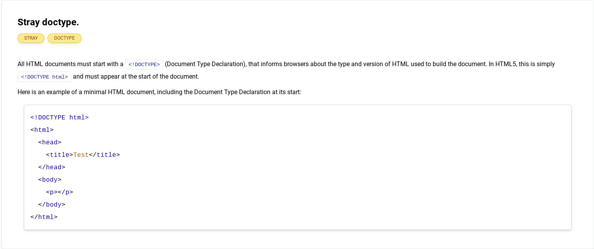
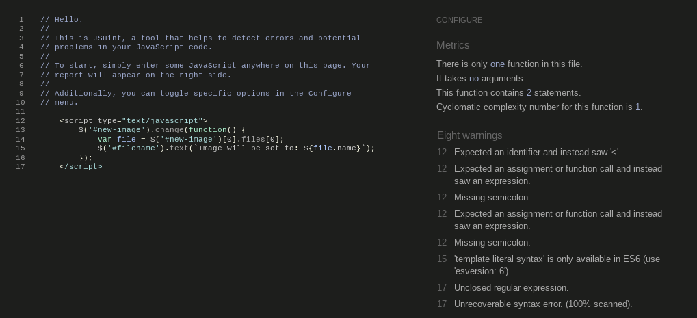
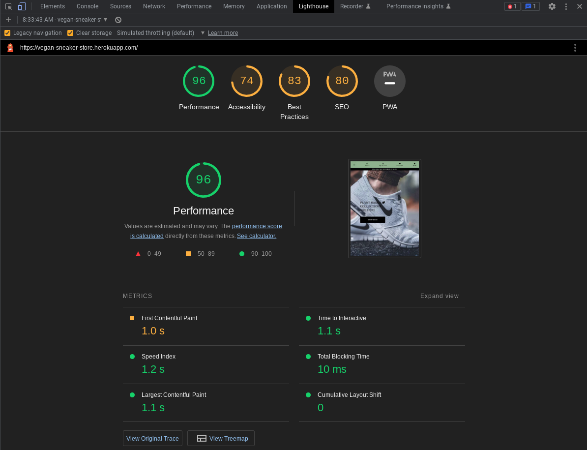

# Testing

## Table of contents

1. [Validator Testing](#validator-testing)
    - [HTML](#html)
    - [CSS](#css)
    - [Python](#python)
    - [JavaScript](#javascript)
2. [Performance Testing](#performance-testing)
    - [Lighthouse](#lighthouse)
3. [Browser Testing](#browser-testing)
4. [Device Testing](#device-testing)
5. [Manual Testing](#manual-testing)
6. [Unit Testing](#unit-testing)
7. [Bugs](#bugs)

## Validator Testing

### HTML

To check markup validity of Web documents as HTML, we used: [W3C Markup Validation Service](https://validator.w3.org/).

Unfortunately since Django tags are conflicting with standard HTML markup, we could not fix those errors.

### CSS

To check Cascading Style Sheets (CSS) validity we used: [W3C CSS Validation Service - Jigsaw](https://jigsaw.w3.org/css-validator/). No errors found.

### Python

For simple python check we used [PythonChecker](https://www.pythonchecker.com/). Most code tested for python logic showed 100%

Additionaly to check our Python code against style conventions in PEP 8 we plan to use: [pep8 - Python style guide checker](https://pypi.org/project/pep8/).

Since online validator was not available at this point we need to install app in our project and perform validation trough terminal.
Documentation [page](https://pep8.readthedocs.io/en/release-1.7.x/)

### JavaScript

To detect errors and potential problems in our JavaScript code we used: [JSHint](https://jshint.com/)

 
1

 
2

 
3

 
4

## Performance Testing

### Lighthouse

"Lighthouse is an open-source, automated tool for improving the performance, quality, and correctness of your web apps.

When auditing a page, Lighthouse runs a barrage of tests against the page, and then generates a report on how well the page did. From here you can use the failing tests as indicators on what you can do to improve your app."

Lighthouse comes integrated by default as part of development tools (DevTools) in Google Chrome browser. You can read more about it [here](https://developer.chrome.com/docs/lighthouse/overview/).

Website excelled in performance, while other areas have more room for improvement.

 
Performance

 
Accessibility

 
Best Practices

 
SEO

## Browser Testing

We tested website on following browsers:

- [Google Chrome](https://www.google.com/chrome/)
- [Mozilla Firefox](https://www.mozilla.org/en-US/firefox/browsers/)
- [Microsoft Edge](https://www.microsoft.com/en-us/edge?form=MA13FJ)
- [Opera](https://www.opera.com/)
- [Brave](https://brave.com/)

Everything worked correctly.

## Device Testing

Website was tested on these available devices:

- Main working laptop: Lenovo Ideapad 3 Chromebook
- Main smartphone: Google Pixel 6 Pro
- Secondary smartphone: LG V30
- Public library desktop computer

Everything performed correctly:  
Loading website, navigating, opening links, shopping, authenticating as user or admin.. and finally, website behaved responsively on all devices.

## Manual Testing

Manual testing was performed alongside with readme section of **Features**.
All features listed there where proven to work as espected, as follows:

Homepage with:
- Navbar
  - All navbar dropdown menus and search bar work as expected, note* Wishlist product page is still to be implemented.
  - Navbar collapses on mobile
  - Logo resizes on smaller screens
- Body
   - Shop now button brings us to the products page
- Footer
   - contact us, facebook link, about us, privacy policy links open as intended, and mailchimp form and contact form work proper. 
   - copyrights link to author github works

Products:
- Products page
   - Clicking on individual products brings us Product detail page
- Product detail
   - Choosing sizes quantity and adding to bag works properly
   - Liking / unliking product edits database and heart icon respectively

Accounts:
- Register / Login
   - New users can register and registered log in
- Product managment
   - Updating product fields works as expected
- My profile
   - On personal profile details can be updated
- Logout works
- Password recovery works only from deployed site, not from local enviroment

Purchasing:
- Shopping bag
   - Updating item quantity in bag works
- Checkout form is working properly and orders are placed
- Purchase overlay shows after purchase
- Stripe webhooks and processes pass correctly and are visible on Stripe dashboard

Rest:
- Toasts pop-up respectively, on purchases, errors, etc..
- 404 page shows correctly when trying to access restricted or non-existing domain.
- External links open in new window

Mobile categories, dropdowns, links and all features as on desktop work as intended.

## Unit Testing

To be added.

[⮪ Return back to readme](README.md) | [Back to Top 🠕](#testing)

